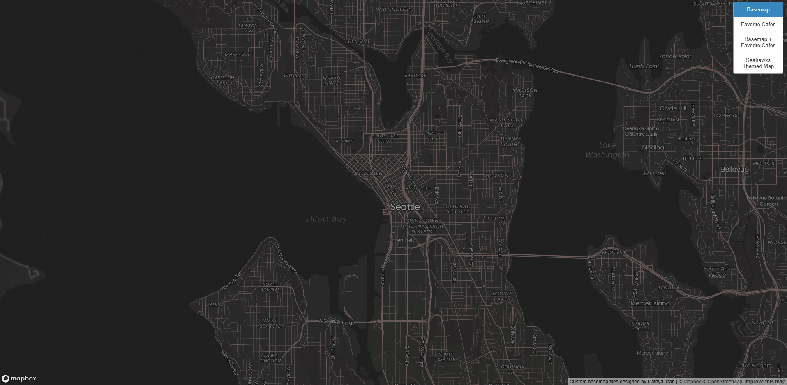
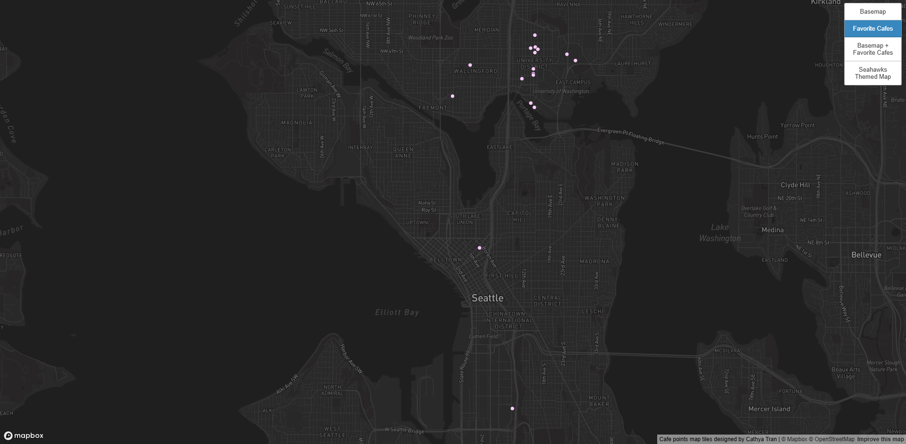
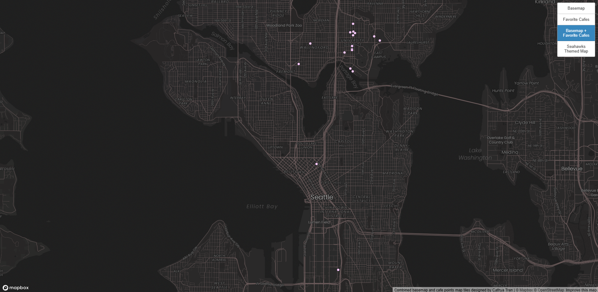
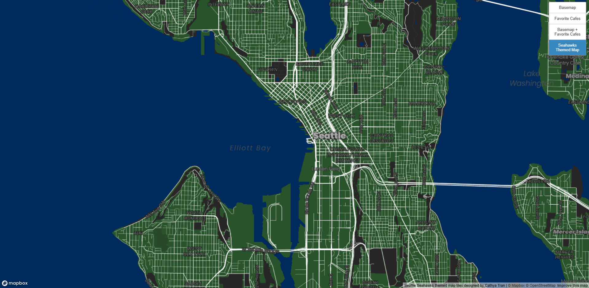

# GEOG 458 Lab 4: Map Tiles
**AI DISCLOSURE**: I used AI in this assignment for: *debugging*. I did not use AI to write or complete any components where AI use is prohibited. 
- Reason for debugging: My map layers for each tile set were not rendering nor showing up on my live view even though my code was complete so I was really confused. I used AI to help me debug and it told me that I misplaced the location of my final curly brace. 

## Web Map URL: https://cathyat.github.io/map-tiles/

## Customized Basemap Tile Set 1:

- **Examined Geographic Area**: Centered on city of Seattle however it does include areas in Bellevue, Renton, and Tukwila.
- **Available Zoom Levels**: 11-15
- **Brief Description**: I focused on the city of Seattle because I tend to use the open sourced government data a lot, so I figure it would be useful to make map tiles for Seattle. I used a classic dark map and played around with the road colors and label fonts to achieve this look. 

## My Favorite Cafes Tile Set 2:

- **Examined Geographic Area**: Centered on city of Seattle however it does include areas in Bellevue, Renton, and Tukwila.
- **Available Zoom Levels**: 11-15
- **Brief Description**: I decided to make my own dataset by creating points on the map of my favorite cafes in Seattle. There are 20 points and many of them are up near UW. I decided to make my own points because I wanted to experiment using my own created data file.

## Customized Basemap + Cafes Tile Set 3:

- **Examined Geographic Area**: Centered on city of Seattle however it does include areas in Bellevue, Renton, and Tukwila.
- **Available Zoom Levels**: 11-15
- **Brief Description**: This tileset has both the customized basemap and the cafe points. This tileset shows the distribution of my favorite cafes and how they are mainly focused around UW area. 

## Seahawks Themed Map Tile Set 4:

- **Examined Geographic Area**: Centered on city of Seattle however it does include areas in Mercer Island. 
- **Available Zoom Levels**: 12-15
- **Brief Description**: I wanted to make a Seahawks themed map in spirit of the upcoming Super Bowl and also because I have never seen one before. I zoomed in more closely to center in on the city of Seattle. 
